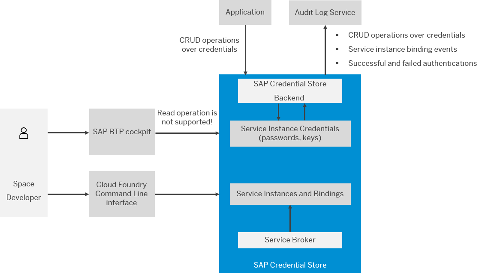

<!-- loio716314af19ea4213aef9790b4331acb0 -->

# Concepts

This section describes basic concepts that will help you familiarize yourself with the SAP Credential Store service.

<a name="loio716314af19ea4213aef9790b4331acb0__section_y2h_zjh_cmb"/>

## SAP BTP cockpit
 
You can perform the following operations through SAP BTP cockpit:

-   Create, update \(edit\), and delete credentials
-   Create and bind service instances
-   Share, unshare, and authorize service instances
-   Create and delete namespaces
-   Set filters for credentials and namespaces
-   Create, download, and delete service keys

> ### Restriction:  
> You cannot read credential values.

<a name="loio716314af19ea4213aef9790b4331acb0__section_g3d_bkh_cmb"/>

## Cloud Foundry Command Line interface

You can perform the following operations through CF CLI:

-   Create and bind service instances
-   Share, unshare, and authorize service instances
-   Create, download, and delete service keys

> ### Restriction:  
> You cannot operate with credentials.

**Related Information**  

[Service Features](service-features-1d7da76.md "")

[Authorization of Bindings](authorization-of-bindings-43e1b4a.md "")

[Administration and Operations](../admin-and-ops/administration-and-operations-8e5c270.md "This section describes the operations that you, as an administrator, can perform with the SAP Credential Store service.")

