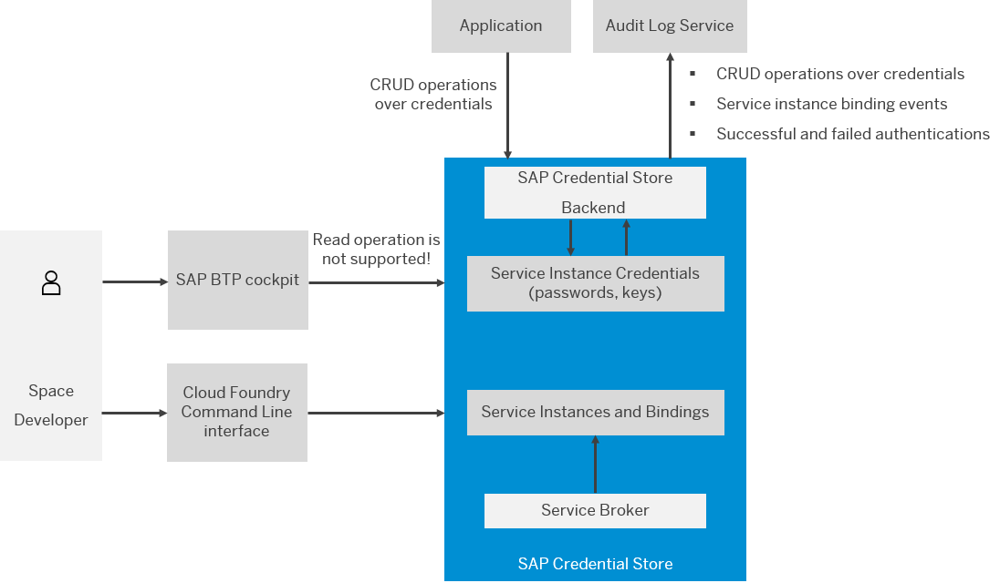

<!-- loio02e8f7d1016740b8adf68690f36df142 -->

# What Is SAP Credential Store?

Store and retrieve credentials such as passwords, keys and keyrings. 

SAP Credential Store service provides a repository for passwords, keys and keyrings for applications that are running on SAP BTP. It enables the applications to retrieve credentials and use them for authentication to external services, or to perform cryptographic operations and TLS communication. SAP Credential Store is exposed to the applications via a REST API.

<a name="loio02e8f7d1016740b8adf68690f36df142__section_ycp_gqj_kbc"/>

## Key Benefits of the Service

-   With SAP Credential Store you can:

-   Create, store and manage cryptographic credentials, which your SAP BTP applications can use to access external services

-   Provide higher level of security by using multi-version cryptographic keys to encrypt or decrypt other cryptographic keys

-   Share service instances between spaces or subaccounts

## Features

<dl>
<dt><b>

Store credentials 

</b></dt>
<dd>

Use the repository to store passwords, cryptographic keys and keyrings for business applications running on Cloud Foundry and Kyma.

</dd><dt><b>

Retrieve credentials 

</b></dt>
<dd>

Retrieve passwords, cryptographic keys and keyrings to use them for authentication to external services.

</dd><dt><b>

Manage service instances 

</b></dt>
<dd>

Create, bind and share service instances by using SAP BTP cockpit or Cloud Foundry Command Line Interface \(cf CLI\).

</dd><dt><b>

Create service keys 

</b></dt>
<dd>

Create a service key if you need to use a service instance from an external application or an application deployed in another space.

</dd><dt><b>

Encrypt data with your own keys 

</b></dt>
<dd>

Your organization can control the encryption keys for data stored in SAP Credential Store by using the SAP Data Custodian service.

</dd>
</dl>

<a name="loio02e8f7d1016740b8adf68690f36df142__section_zmt_5wy_5sb"/>

## Environment

SAP Credential Store is available in the following environments:

-   Cloud Foundry environment
-   Kyma environment

<a name="loio02e8f7d1016740b8adf68690f36df142__section_pkk_smg_3nb"/>

## Overview Graphic

## Tools

You can access the *Credential Store* tile in the SAP BTP cockpit, in your Cloud Foundry or Kyma space.

## Technical Constraints

You can use only **1** service instance per space.

The following plans and metrics are available to you:

<table>
<tr>
<th valign="top">

Plan

</th>
<th valign="top">

API Calls per Second

</th>
<th valign="top">

Bindings

</th>
<th valign="top">

Credentials

</th>
<th valign="top">

Key Size

</th>
<th valign="top">

Namespaces

</th>
<th valign="top">

Password Size

</th>
<th valign="top">

Total Size

</th>
</tr>
<tr>
<td valign="top">

free

</td>
<td valign="top">

3

</td>
<td valign="top">

3

</td>
<td valign="top">

10

</td>
<td valign="top">

32 KB

</td>
<td valign="top">

10

</td>
<td valign="top">

4 KB

</td>
<td valign="top">

0.1 MB

</td>
</tr>
<tr>
<td valign="top">

standard

</td>
<td valign="top">

25

</td>
<td valign="top">

100

</td>
<td valign="top">

100,000

</td>
<td valign="top">

32 KB

</td>
<td valign="top">

10,000

</td>
<td valign="top">

4 KB

</td>
<td valign="top">

100 MB

</td>
</tr>
<tr>
<td valign="top">

proxy\*

</td>
<td valign="top">

25

</td>
<td valign="top">

100

</td>
<td valign="top">

100,000

</td>
<td valign="top">

32 KB

</td>
<td valign="top">

10,000

</td>
<td valign="top">

4 KB

</td>
<td valign="top">

100 MB

</td>
</tr>
</table>

\*A **proxy** plan inherits the standard plan along with its metrics. Also, the proxy plan is only applied to scenarios that require service instance sharing. For more information, see: [Share, Unshare, and Authorize a Service Instance](admin-and-ops/share-unshare-and-authorize-a-service-instance-bcd0a59.md)

> ### Restriction:  
> If you create multiple proxy instances related to a single standard instance, then all these proxy instances together will be allowed to create up to 100,000 credentials. The same rule applies to all other metrics – they can altogether make up to 25 calls per second, or bind up to 100 applications, and so on.

<a name="loio02e8f7d1016740b8adf68690f36df142__section_ewx_hc2_5gb"/>

## Regions

To check in which regions SAP Credential Store is available, see:

-   [Discovery Center: Credential Store](https://discovery-center.cloud.sap/#/serviceCatalog/credential-store?region=all&tab=service_plan)

-   [Cloud Foundry Regions and API Endpoints](https://help.sap.com/docs/btp/sap-business-technology-platform/regions-and-api-endpoints-available-for-cloud-foundry-environment?version=Cloud)

